# Construindo um modelo de Regressão para marketing

## Índice
- [Contextualização do modelo](#contextualização-do-modelo)
    - [Contexto](#contexto)
    - [Resultado esperado](#resultado-esperado)
    - [Recomendações](#recomendações)
    - [Dados](#dados)
- [Entendimento dos Dados](#entendimento-dos-dados)
    - [Objetivo](#objetivo)
    - [Variável target](#variável-target)
    - [Variáveis explicativas](#variáveis-explicativas)
    - [Relação entre a variável target e as variáveis explicativas](#relação-entre-a-variável-target-e-as-variáveis-explicativas)
    - [Somatório dos investimentos](#somatório-dos-investimentos)
    - [Hipótese](#hipótese)
- [Resultados](#resultados)
    - [Correlações](#correlações)
    - [Treinamento do modelo](#treinamento-do-modelo)
    - [R-squared](#r-squared)
    - [Comparação entre dados reais e preditos](#comparação-entre-dados-reais-e-preditos)
- [Testando a hipótese](#testando-a-hipótese)
    - [Cálculo de contribuição](#cálculo-de-contribuição)
    - [Acrescentando as colunas do teste](#acrescentando-as-colunas-do-teste)
    - [Acrescentando a predição de vendas de teste](#acrescentando-a-predição-de-vendas-de-teste)
    - [Comparando valores reais com valores da hipótese](#comparando-valores-reais-com-valores-da-hipótese)
    - [Observando as médias reais e da hipótese](#observando-as-médias-reais-e-da-hipótese)     
- [Conclusão](#conclusão)

## Contextualização do modelo:
### Contexto:
Uma empresa está investindo mensalmente em plataformas de publicidade online, como Youtube, Facebook e newspaper, para a prospecção de leads (pessoas interessadas em seus produtos). A fim de acompanhar o desempenho desses investimentos, a empresa registra todos os gastos com publicidade e todos os retornos de vendas gerados a partir desses investimentos.

Para entender melhor a relação entre as variáveis presentes nesses registros e identificar os fatores que mais impactam na geração de leads, a empresa solicitou a análise de um especialista em dados. Além disso, a empresa busca criar um modelo de predição de valores para estimar o retorno de vendas que pode ser gerado a partir de um determinado investimento em publicidade.
### Resultado esperado:
Construir um modelo de Regressão para marketing para realizar previsões de retorno de vendas que pode ser gerado a partir de um determinado investimento em publicidade e assim, apresentá-lo a empresa.
Através dessas previsões, poderemos avaliar o impacto dos diferentes níveis de investimento em marketing nas vendas, auxiliando na tomada de decisões e na definição de estratégias de negócio.
### Recomendações:
Faça a análise descritiva, faça análise exploratória, faça modelagem, calcule predição e recomende alterações para proporcionar maior número de vendas.  
### Dados:
A tabela contém informações dos investimentos feitos pelo youtube, facebook, newspaper e os retornos de vendas. 
Abaixo estão as cinco primeiras linhas dos dados que foram disponibilizados em uma planilha do Excel com 171 linhas e 4 colunas.

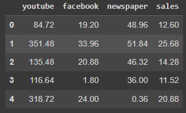

## Entendimento dos dados:
### Objetivo:
Criar um modelo de predição de valores para estimar o retorno de vendas que pode ser gerado a partir de um determinado investimento em publicidade.
### Variável target:
A variável target deste exercício é a coluna "sales".
### Variáveis explicativas:
As variáveis explicativas deste exercício são as colunas "youtube", "facebook" e "newspaper".
### Relação entre a variável target e as variáveis explicativas:
Foram feitos gráficos de pairplot para analisar visualmente o comportamento dos dados das plataformas com relação as vendas, como pode ser visto abaixo.

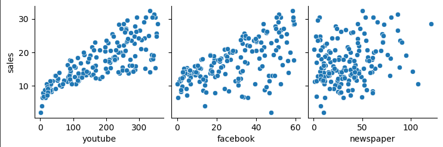

Esses dados também podem ser observados em forma numérica, onde a correlação varia de 0-1, e quanto maior a correlação entre as variáveis mais relacionadas elas estão, o youtube tem maior correlação, seguido pelo facebook, e por fim o newspaper, como pode ser visto abaixo.

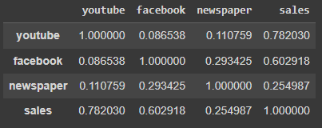

### Somatório dos investimentos:
Com o intuito de saber como estão sendo feito os investimentos, foi feito um somatório dos valores investidos por plataforma, como pode ser visto abaixo.

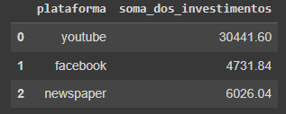

### Hipótese:
Como o facebook tem maior correlação sobre as vendas do que o newspaper, vale realizar um teste para ver o comportamento das vendas ao aumentar o investimento do facebbok e diminuir o investimento no newspaper.

## Resultados:
### Correlações:
Ao observar o gráfico de pairplot, nota-se que o youtube é o valor que se relaciona mais diretamente com as vendas, visto que os dados estão bem agrupados. O facebook também tem um comportamento proporcional as vendas, mas é um pouco mais disperso. Já o newspaper, nota-se um comportamento muito mais disperso que os outros, ou seja, provavelmente o newspaper tenha baixo impacto nas vendas ao se comparar com os demais.

### Treinamento do modelo:
Para realizar o treino do modelo, 70% do dados foram separados como variáveis de treino e 30% como variáveis de teste, onde 119 linhas dos dados foram utilizadas para treino e 52 para teste, como pode ser visto abaixo.

### R-squared:
Após realizar o treino do modelo, foi feito o cálculo do R² para saber a % de acerto do modelo, como pode ser visto abaixo.

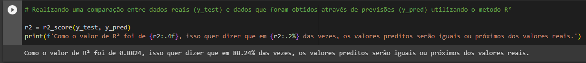

### Comparação entre dados reais e preditos:
Abaixo está o gráfico que mostra como os valores previstos e os valores reais são semelhantes.

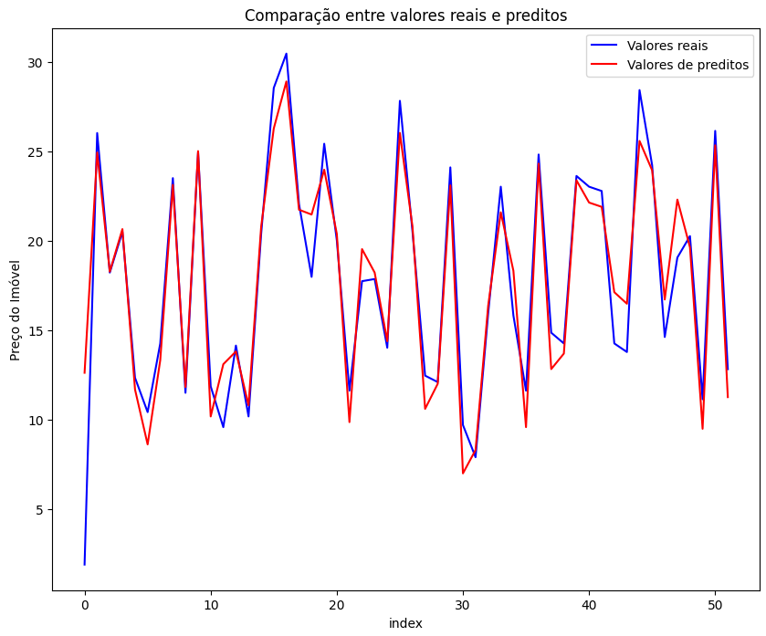

## Testando a hipótese:
### Cálculo de contribuição:
Parti da ideia de que as vendas variam de acordo com a correlação do investimento nas plataformas em realação as vendas. Baseado nesses valores (youtube 0.7820, facebook 0.6029, newspaper 0.2549), foram feitos cálculos para calcular a porcentagem de contribuição de cada variável, como pode ser visto abaixo.

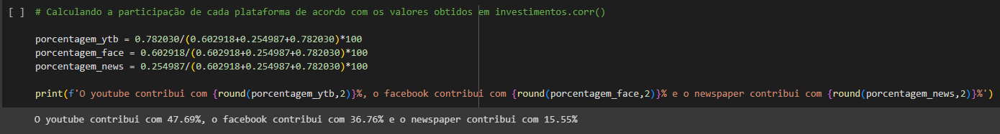

### Acrescentando as colunas do teste:
Foi escolhido testar a seguinte premissa: somar o valor investido nas plataformas e investir 47.69% no youtube, 36,76% no face e 15,55% em newspaper.

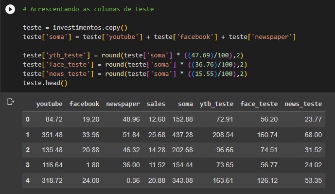

### Acrescentando a predição de vendas de teste:
Foram cálculados valores previstos utilizando as colunas de teste, gerando a coluna "predição_teste", que foi adicionada ao dataframe teste, como pode ser visto a seguir.

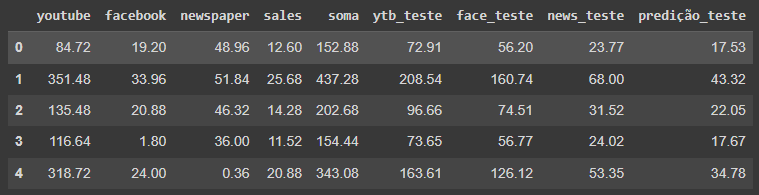

### Comparando valores reais com valores da hipótese:
Foi feito um novo dataframe com as "sales" que são as vendas reais, predição que são as vendas da hipótese, aumento que é a "predição" - "sales", e o aumento em % que é o "aumento"/"sales". Abaixo estãos as 10 primeiras linhas dos dados gerados.

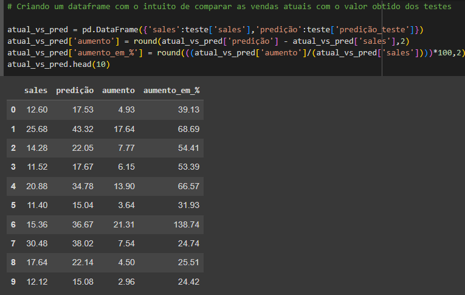

### Observando as médias reais e da hipótese: 
Foi feito um describe() nos dados reais e de hipotese para observar os valores médios e tirar insights.

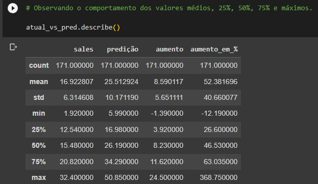

## Conclusão:

Ao olhar os valores descritos, percebe-se que houve um aumento médio de 52,38% nas vendas ao utilizar a premissa de somar o valor investido nas plataformas e investir 47.69% no youtube, 36,76% no face e 15,55% em news.