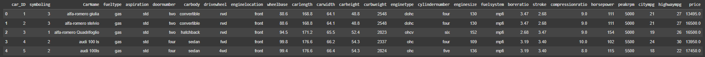
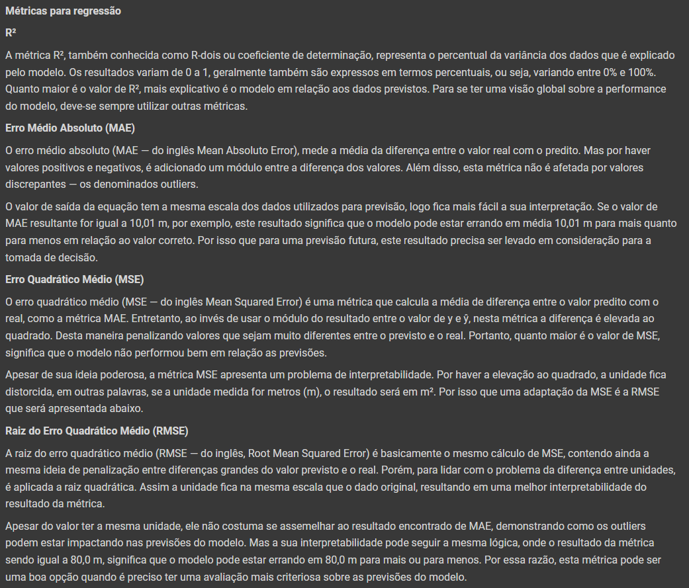
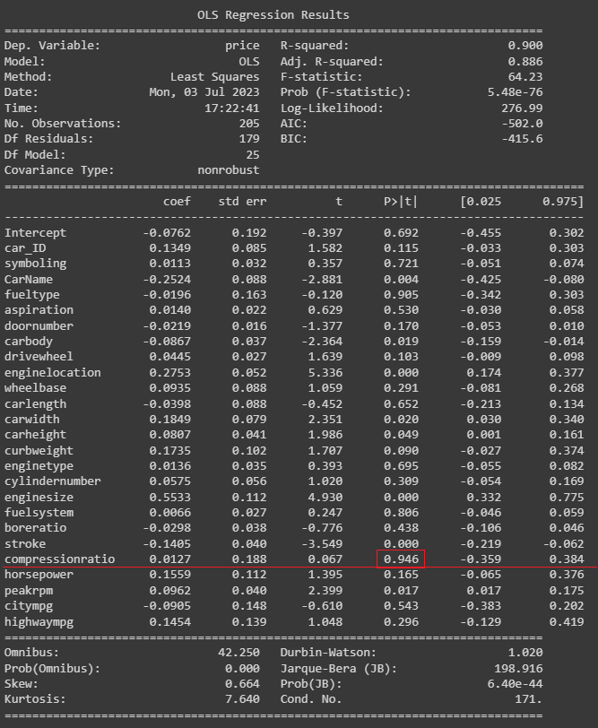
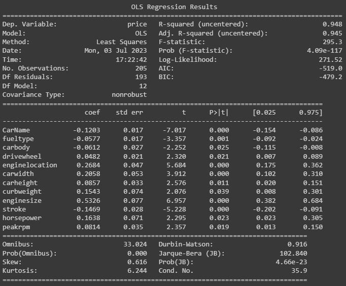
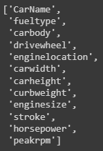
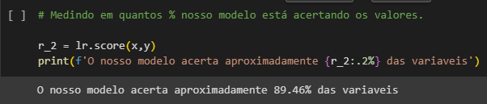
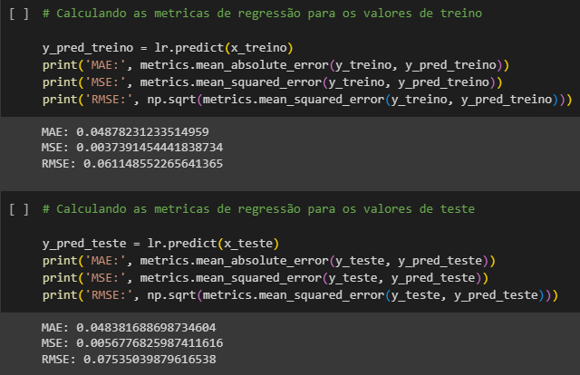

# Projeto de Regressão Linear Multipla

## Índice
- [Contextualização do exercício](#contextualização-do-exercício)
    - [Contexto](#contexto)
    - [Resultado esperado](#resultado-esperado)
    - [Recomendações](#recomendações)
    - [Dados](#dados)
- [Entendimento dos Dados](#entendimento-dos-dados)
    - [Objetivos](#objetivos)
    - [Métricas para regressão](#métricas-para-regressão)    
    - [Variável target](#variável-target)
    - [Variáveis explicativas](#variáveis-explicativas)
- [Resultados](#resultados)
    - [Sumário OLS](#sumário-ols)
    - [Treino e teste](#treino-e-teste)
    - [R² score](#r²-score)
    - [Comparação entre métricas de treino e teste](#comparação-entre-métricas-de-treino-e-teste)
- [Conclusão](#conclusão)

## Contextualização do exercício:
### Contexto:
Um funcionário de uma loja de carros gostaria de saber precificar os carros de acordo com os dados disponibilizados.
### Resultado esperado:
Crie um modelo que consiga prever o valor dos automóveis com base nas várias variáveis explicativas.
### Recomendações:
Faça as seguintes métricas de regressão: R², Erro Médio Absoluto (MAE), Erro Quadrático Médio (MSE) e Raiz do Erro Quadrático Médio (RMSE). Com o intuito de saber a performance do modelo.  
### Dados:
Abaixo estão as cinco primeiras linhas dos dados que foram disponibilizados em uma planilha do Excel com 205 linhas e 26 colunas.

## Entendimento dos dados:
### Objetivos:
Fazer o sumário OLS utilizando o Método Backward para selecionar as variáveis explicativas.
Fazer as métricas de regressão separando os dados em 80% para treino e 20% para teste. Ao comparar esses dados é possível saber se o modelo está performando bem.
### Métricas para regressão:

### Variável target:
A variável target deste exercício é a coluna "price".
### Variáveis explicativas:
As variáveis explicativas deste exercício são as outras 25 colunas.

## Resultados:
### Sumário OLS:
Abaixo está o primeiro sumário OLS que foi obtido, destacando a variável com o maior P-Value.

O Método Backward consiste em avaliar os valores de P-Value e remover o maior valor até que não hajam valores de P-Value maior do que 0.1 (10%).

Após realizar as tratativas, ficamos com o seguinte sumário OLS.

### Treino e teste:
Nessa etapa os dados são separados em 80% para treino e 20% para teste. Onde a variável target é o price e as variáveis explicativas são as variáveis em que o P-value foi menor que 10%. Abaixo está a lista das variáveis explicativas.

### R² score:
Em seguida está o valor do nosso R².

### Comparação entre métricas de treino e teste:
Em seguida está a comparação que mostra como os valores de teste e os valores de treino são próximos.

## Conclusão:

Como foi visto no sumário OLS, o valor de R² (R-squared) foi de 0.948 o que indica que os valores previstos acertam com precisão de aproximadamente 94.80%. Além disso, ao realizar o modelo preditivo, foi obtido o valor de R² = 89.46%. E, para finalizar, os valores de MAE, MSE e RMSE da base de teste e da base de treino foram muito próximos, todos esses teste comprovam que o modelo performou bem.