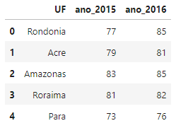
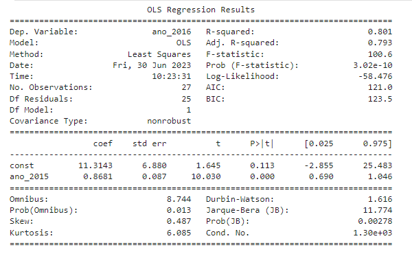
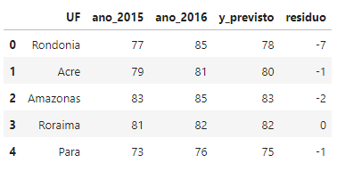
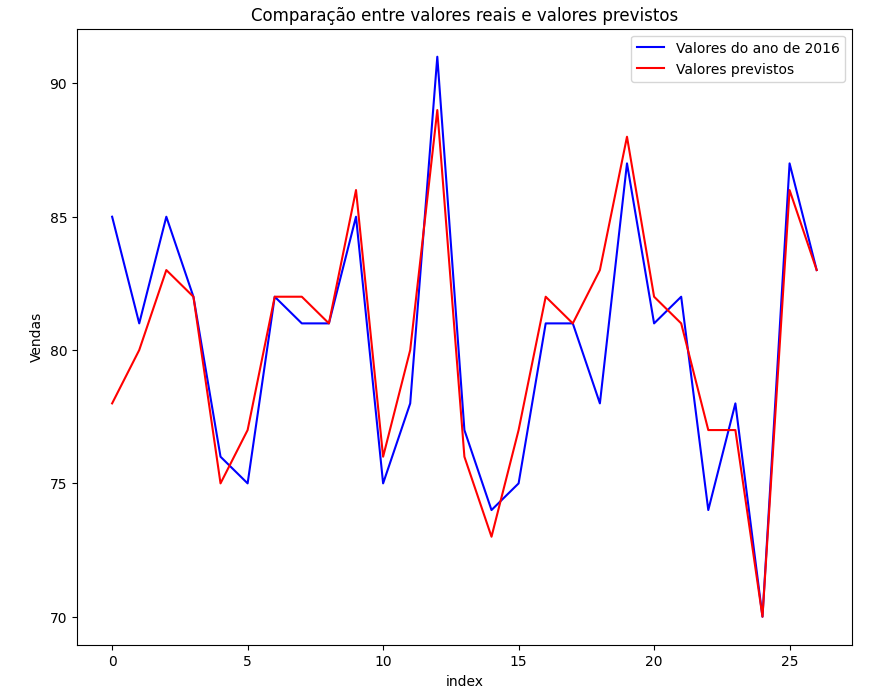

# Projeto de Regressão Linear Simples

## Índice
- [Contextualização do exercício](#contextualização-do-exercício)
    - [Contexto](#contexto)
    - [Resultado esperado](#resultado-esperado)
    - [Recomendações](#recomendações)
    - [Dados](#dados)
- [Entendimento dos Dados](#entendimento-dos-dados)
    - [Objetivo](#objetivo)
    - [Variável target](#variável-target)
    - [Métricas](#métricas)
- [Resultados](#resultados)
    - [Sumário OLS](#sumário-ols)
    - [Dados](#dados)
    - [Comparação entre dados reais e preditos](#comparação-entre-dados-reais-e-preditos)
- [Conclusão](#conclusão)

## Contextualização do exercício:
### Contexto:
O Ministério da Educação solicitou uma previsão do percentual de alunos que serão aprovados no ano de 2017, tendo como base o ano de 2016.
### Resultado esperado:
Crie um modelo que consiga prever o valor de aprovação de 2016 com base nas aprovações de 2015.
### Recomendações:
Faça o tratamento dos dados, faça regressão linear e tire o resíduo para saber em quanto o modelo está errando.  
### Dados:
Abaixo estão as cinco primeiras linhas dos dados que foram disponibilizados em uma planilha do Excel com 27 linhas e 3 colunas.

## Entendimento dos dados:
### Objetivo:
Realizar predições de 2016 utilizando os dados de 2015. Com base nessa predição, criar uma coluna de resíduo para fazer uma comparação entre os dados previstos com os dados reais.
### Variável target:
A variável target deste exercício é a coluna "ano_2016".
### Métricas:
A variável métrica deste exercício é a coluna "ano_2015".

## Resultados:
### Sumário OLS:
Abaixo está o sumário OLS que foi obtido.

### Dados:
Abaixo estão as cinco primeiras linhas dos dados que foram obtidos.

### Comparação entre dados reais e preditos:
Abaixo estão as cinco primeiras linhas dos dados que foram obtidos.

## Conclusão:

Como foi visto no sumário OLS, o valor de R² (R-squared) foi de 0.801 o que indica que os valores previstos acertam com precisão de aproximadamente 80.10%. Além disso, ao observar o gráfico da comparação entre valores reais e previstos, é facil ver que os dados previstos são muito próximos dos valores reais.