# Levantamento dos Indicadores RFM para uma Empresa de E-commerce

## Índice
- [Como abrir o projeto no colab](#Como-abrir-o-projeto-no-colab)
    - [Link Github](#Link-Github)
    - [Acessando o site](#Acessando-o-site)
    - [Acessando o código](#Acessando-o-código)
    - [Base de dados](#Base-de-dados)
- [Contextualização do modelo](#contextualização-do-modelo)
    - [Contexto](#contexto)
    - [Resultado esperado](#resultado-esperado)
    - [Recomendações](#recomendações)
    - [Dados](#dados)
- [Entendimento dos Dados](#entendimento-dos-dados)
    - [Objetivo](#objetivo)
    - [Linhas duplicadas](#linhas-duplicadas)
    - [Itens nulos](#itens-nulos)
    - [Objetivo](#objetivo)
    - [Objetivo](#objetivo)  
- [Desenvolvimento](#desenvolvimento)
    - [Duplicatas](#duplicatas)
    - [Porcentagem nulos](#porcentagem-nulos)
    - [Quantidade e preço nulos ou negativos](#quantidade-e-preço-nulos-ou-negativos)
    - [Nulos](#nulos)
- [Tipos de dados](#tipos-de-dados)
    - [Conferindo os tipos de dados](#Conferindo-os-tipos-de-dados)
    - [Colunas tipo object](#colunas-tipo-object)
    - [Corrigindo a coluna InvoiceDate](#corrigindo-a-coluna-InvoiceDate)
    - [Corrigindo a coluna CustomerID](#corrigindo-a-coluna-CustomerID)
    - [Conferência final](#conferência-final)
- [Dados dispensáveis](#Dados-dispensáveis)
    - [País Unspecified](#país-Unspecified)
    - [Outliers](#Outliers)
- [Dados extras necessários](#Dados-extras-necessários)
    - [Preço total](#Preço-total)
    - [Última compra](#Última-compra)

## Como abrir o projeto no colab
Para ter acesso ao projeto no google colab será necessário realizar alguns passos

### Link Github
Para obter o link do projeto, siga os seguintes passos:

1- Acesse o meu perfil do github através do site: github.com/caiolima159

2- Clique no repositório chamado de Biblioteca-Pandas.

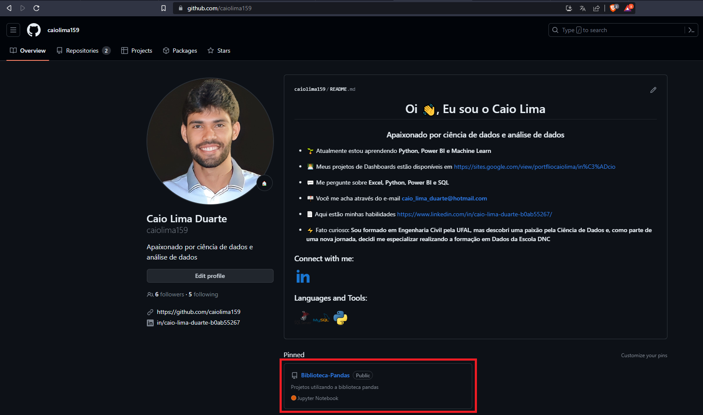

3- Acesse a pasta de tratamento de dados

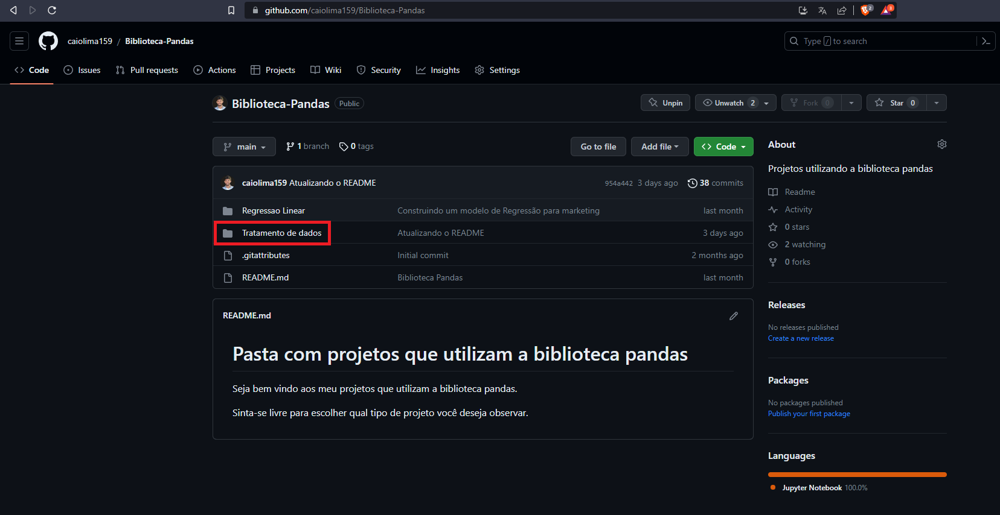

4- Acesse a pasta main

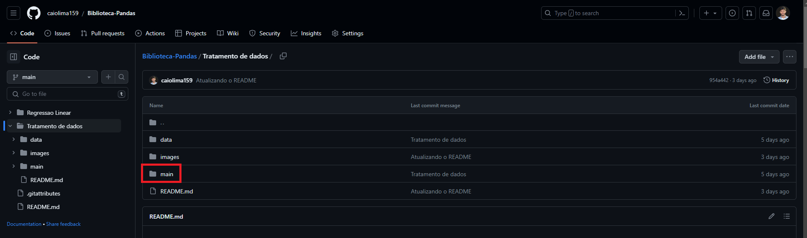

5- Acesse as opções

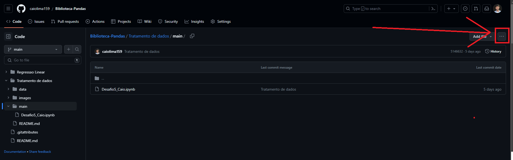

6- Clique em copy permalink

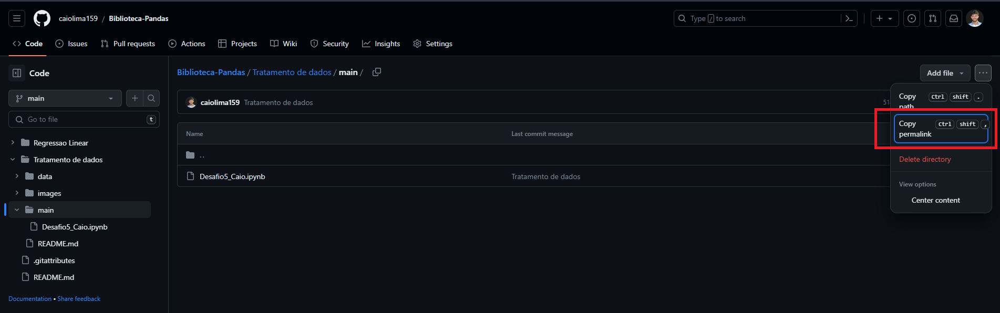

### Acessando o site
Pesquise por google colab no google e clique no primeiro link

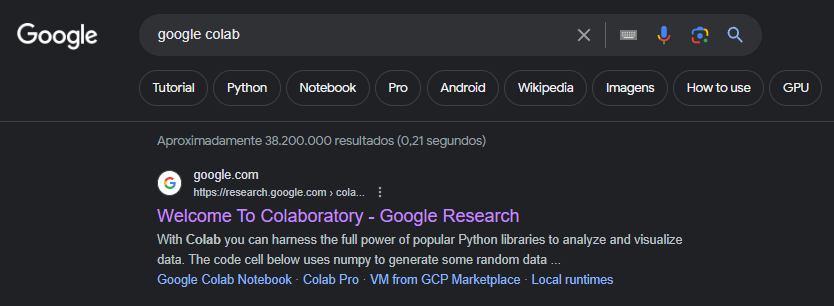

### Acessando o código
Ao acessar o site do colab, clique na aba GitHub

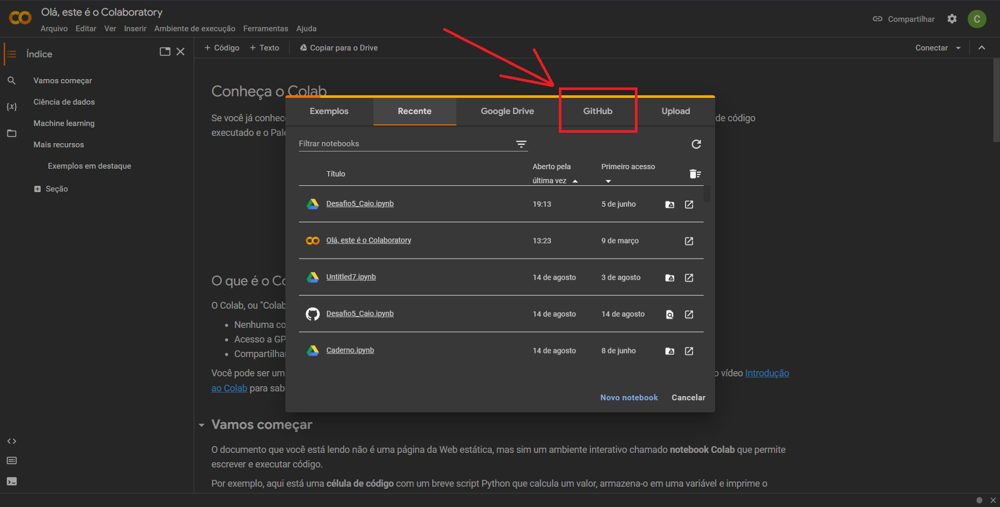

Em seguida, basta colar o link obtido no GitHub e selecionar a opção de Desafio5

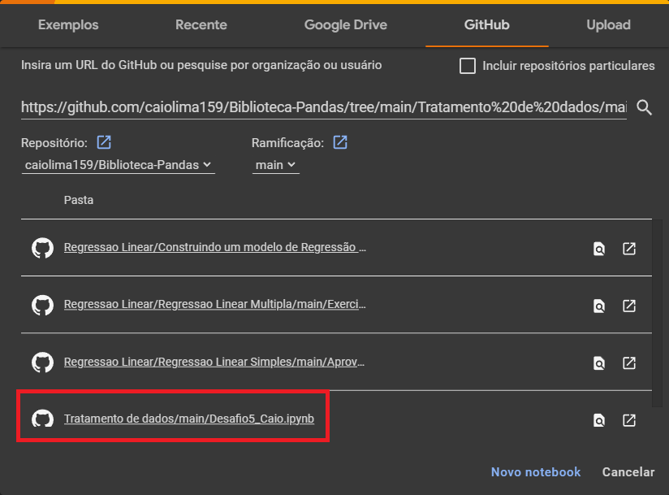

Após esses passos você estará vendo o código do projeto.

## Contextualização do modelo:
### Contexto:
Uma empresa do ramo de e-commerce contratou você para levantar os indicadores de recência, frequência e ticket médio (RFM) dos seus clientes.
Sobre RFM:
R (Recency): Tempo que o cliente realizou a última compra (em dias);
F (Frequency): Quantidade de compras realizadas pelo cliente;
M (Monetary): Valor do ticket médio gasto pelo cliente.
onde ticket médio = média do total gasto por pedido para cada cliente.
Para isso, vocês receberam uma base de dados (arquivo csv) e devem construir um código em Python que gera um output também csv, porém contendo apenas a identificação do cliente e métricas RFM.

### Resultado esperado:
Levantar indicadores de recência, frequência e ticket médio (RFM) dos seus clientes, utilizando a base de dados fornecida pela empresa.
Além disso, deve ser feito um output em csv contendo apenas a identificação do cliente e as métricas RFM.
### Recomendações:
Entenda os dados, faça tratamento dos nulos, faça tratamento nos outliers, faça o RFM e gere um arquivo csv com os dados solicitados.  
### Dados:
A tabela contém informações de vendas. 
Abaixo estão as cinco primeiras linhas dos dados que foram disponibilizados em umarquivo do tipo csv com 541909 linhas e 8 colunas.

## Entendimento dos dados:
### Objetivo:
Realizar tratamento de dados e desenvolver um algoritmo para receber o arquivo csv de entrada e retornar um algoritmo de saída com as seguintes colunas: CustomerID: Código do cliente, R: Recência, F: Frequência, M: Ticket médio.
### Linhas duplicadas:
No DataFrame foram observadas 5268 linhas duplicadas, para ter certeza se as colunas duplicadas seriam removidas. Com isso, decidi agrupar os dados e ordenar para visualizar as linhas com mais duplicatas primeiro.

### Itens nulos:
Ao realizar um código para observar os itens nulos, notou-se que haviam nulos em apenas 2 colunas: Description e CustomerID.

## Desenvolvimento:
### Duplicatas:
Após analisar os dados duplicas, e concluir que eram erros, optou-se por remover estes dados.
### Porcentagem nulos:
Foi feita uma análise para saber a porcentagem de dados faltantes, com o intuito de saber o impacto desses dados nulos no DataFrame.

### Quantidade e preço nulos ou negativos:
Uma vez que não são possíveis vendas negativas, tanto em quantidade quanto em preço, as linhas que se enquadravam nessas condições foram removidas. Ao realizar essa tratativas sobraram apenas valores nulos na coluna CustomerID.

### Nulos:
Por fim, foram removidos os nulos restantes, visto que o estudo necessita da identificação dos clientes para realizar o RFM.

## Tipos de dados:
### Conferindo os tipos de dados:
Foram analisados os tipos de dados para saber se estão de acordo com o esperado.

### Colunas tipo object:
Foi feita uma conferência dos tipos de dados em cada coluna em que o tipo é object.

### Corrigindo a coluna InvoiceDate:
A coluna InvoiceDate deveria ser do tipo data, mas está como string. Com isso, foi feita uma tratativa para realizar essa mudança.

### Corrigindo a coluna CustomerID:
A coluna InvoiceDate deveria ser do tipo inteiro, mas está como string. Com isso, foi feita uma tratativa para realizar essa mudança.

### Conferência final:
Por fim, foi feita a conferência final dos tipos de dados.

## Dados dispensáveis:
### País Unspecified:
Ao observar os dados presentes na coluna Country, foi visto que haviam dados do país "Unspecified", como precisamos saber a origem dos dados, decidiu-se remover estes dados.

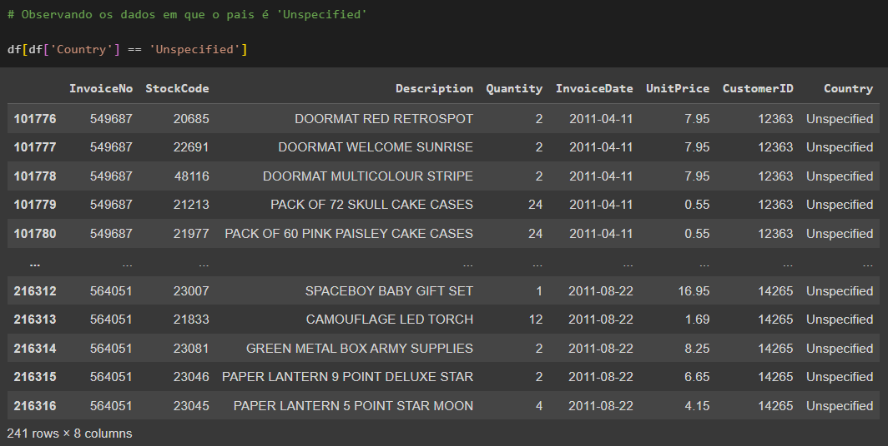

### Outliers
A empresa definiu que os seguintes tipos de dados eram erros que devem ser removidos: quantidade maior que 10k ou o preço unitário maior que 5k. Dito isto, esses dados foram removidos do DataFrame.

## Dados extras necessários:
### Preço total:
Foi criada uma coluna com o preço total das compras para que fosse possível realizar alguns cálculos. Essa coluna foi formada atráves da multiplicação da quantidade vezes o preço unitário, e recebeu o nome de Total.
### Última compra
Calculando a data da última compra no dataset como um todo, pois vamos utilizar este valor como data de comparação para cálculo da recência.

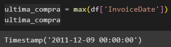

## Gráficos
### Top 10 países em valor de vendas
Calculando a soma total das vendas feitas por cada país e classificando os 10 maiores.

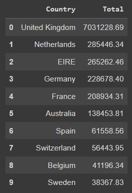

Baseado nesses valores, foi traçado um gráfico de barras para melhorar a visualização dos resultados.

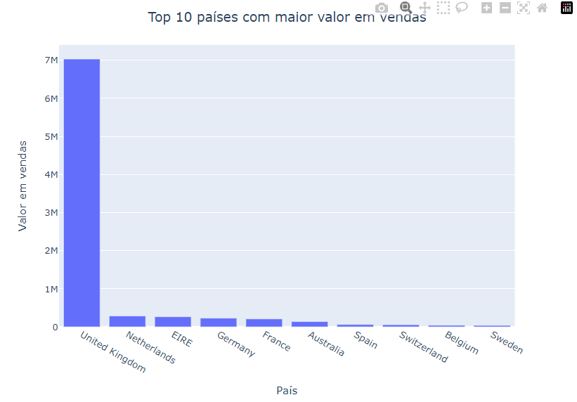

### Top 10 produtos mais vendidos
Calculando a soma total das quantidades vendidas de cada produto e classificando os 10 maiores.

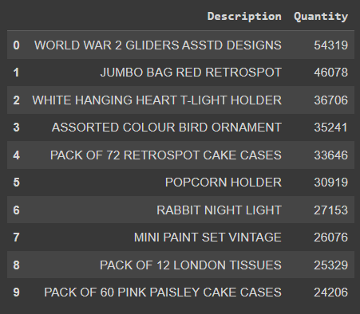

Baseado nesses valores, foi traçado um gráfico de barras para melhorar a visualização dos resultados.

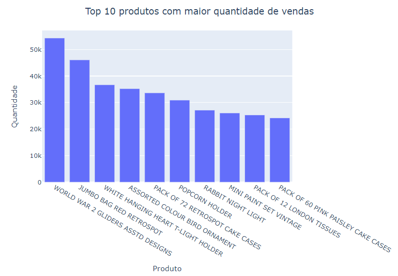

### Top 10 valor de venda por mês
Calculando o valor de venda total por mês e classificando os 10 maiores.

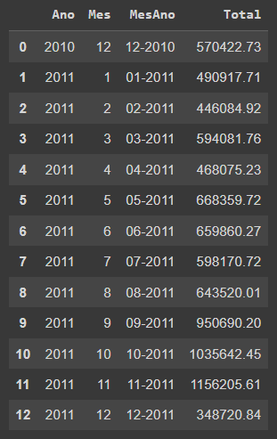

Baseado nesses valores, foi traçado um gráfico de linhas para melhorar a visualização dos resultados.

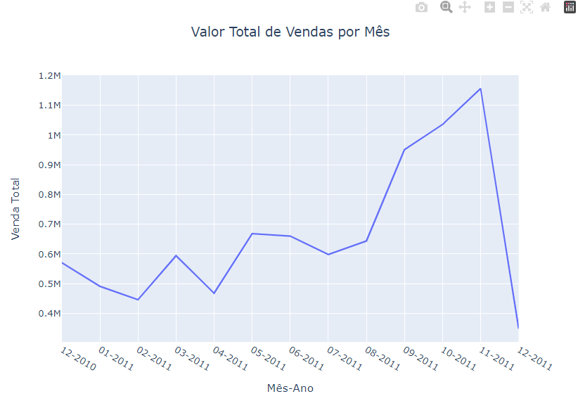

### Top 10 valor de venda total por mês e por país
Calculando o valor de venda total por mês e por país e classificando os 10 maiores.

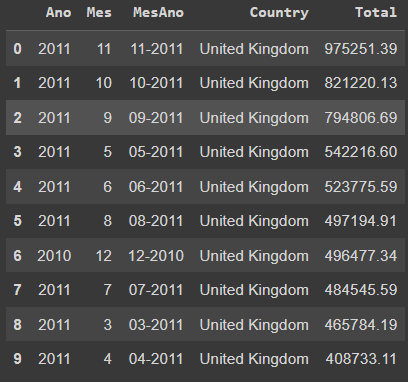

Baseado nesses valores, foi traçado um gráfico de barras para melhorar a visualização dos resultados.

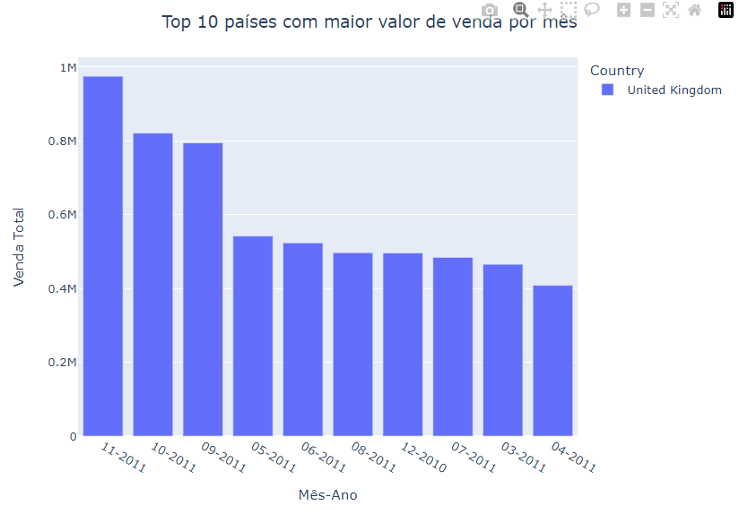

## RFM
### Criando o RFM
Foi feito um novo DataFrame com apenas as informações de CustomerID, Recency, Frequency e Monetary_Value, onde:

CustomerID é a identificação do cliente;

Recency é a quantidade de dias que o cliente não faz compras;

Frequency é a quantidade de vezes que este cliente fez compras;

Monetary_Value é a quantidade de dinheiro que o cliente gastou.

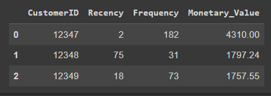