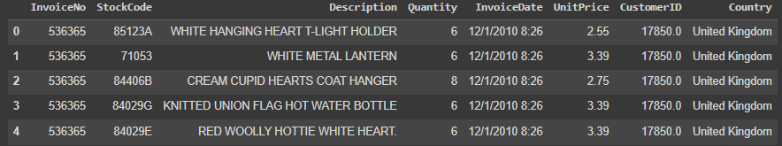
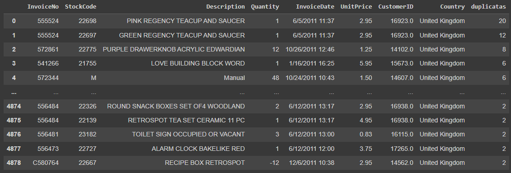
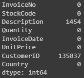
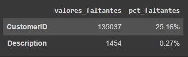
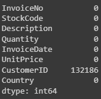
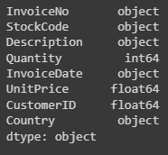
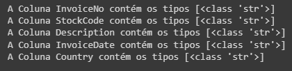
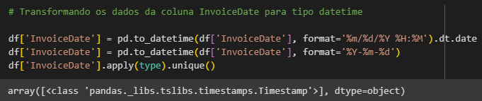
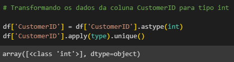
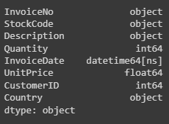

# Construindo um modelo de Regressão para marketing

## Índice
- [Contextualização do modelo](#contextualização-do-modelo)
    - [Contexto](#contexto)
    - [Resultado esperado](#resultado-esperado)
    - [Recomendações](#recomendações)
    - [Dados](#dados)
- [Entendimento dos Dados](#entendimento-dos-dados)
    - [Objetivo](#objetivo)
    - [Linhas duplicadas](#linhas-duplicadas)
    - [Itens nulos](#itens-nulos)
    - [Objetivo](#objetivo)
    - [Objetivo](#objetivo)  
- [Desenvolvimento](#desenvolvimento)

## Contextualização do modelo:
### Contexto:
Uma empresa do ramo de e-commerce contratou você para levantar os indicadores de recência, frequência e ticket médio (RFM) dos seus clientes.
Sobre RFM:
R (Recency): Tempo que o cliente realizou a última compra (em dias);
F (Frequency): Quantidade de compras realizadas pelo cliente;
M (Monetary): Valor do ticket médio gasto pelo cliente.
onde ticket médio = média do total gasto por pedido para cada cliente.
Para isso, vocês receberam uma base de dados (arquivo csv) e devem construir um código em Python que gera um output também csv, porém contendo apenas a identificação do cliente e métricas RFM.

### Resultado esperado:
Levantar indicadores de recência, frequência e ticket médio (RFM) dos seus clientes, utilizando a base de dados fornecida pela empresa.
Além disso, deve ser feito um output em csv contendo apenas a identificação do cliente e as métricas RFM.
### Recomendações:
Entenda os dados, faça tratamento dos nulos, faça tratamento nos outliers, faça o RFM e gere um arquivo csv com os dados solicitados.  
### Dados:
A tabela contém informações de vendas. 
Abaixo estão as cinco primeiras linhas dos dados que foram disponibilizados em umarquivo do tipo csv com 541909 linhas e 8 colunas.

## Entendimento dos dados:
### Objetivo:
Realizar tratamento de dados e desenvolver um algoritmo para receber o arquivo csv de entrada e retornar um algoritmo de saída com as seguintes colunas: CustomerID: Código do cliente, R: Recência, F: Frequência, M: Ticket médio.
### Linhas duplicadas:
No DataFrame foram observadas 5268 linhas duplicadas, para ter certeza se as colunas duplicadas seriam removidas. Com isso, decidi agrupar os dados e ordenar para visualizar as linhas com mais duplicatas primeiro.

### Itens nulos:
Ao realizar um código para observar os itens nulos, notou-se que haviam nulos em apenas 2 colunas: Description e CustomerID.

## Desenvolvimento:
### Duplicatas:
Após analisar os dados duplicas, e concluir que eram erros, optou-se por remover estes dados.
### Porcentagem nulos:
Foi feita uma análise para saber a porcentagem de dados faltantes, com o intuito de saber o impacto desses dados nulos no DataFrame.

### Quantidade e preço nulos ou negativos:
Uma vez que não são possíveis vendas negativas, tanto em quantidade quanto em preço, as linhas que se enquadravam nessas condições foram removidas. Ao realizar essa tratativas sobraram apenas valores nulos na coluna CustomerID.

### Nulos:
Por fim, foram removidos os nulos restantes, visto que o estudo necessita da identificação dos clientes para realizar o RFM.

## Tipos de dados:
### Conferindo os tipos de dados:
Foram analisados os tipos de dados para saber se estão de acordo com o esperado.

### Colunas tipo object:
Foi feita uma conferência dos tipos de dados em cada coluna em que o tipo é object.

### Corrigindo a coluna InvoiceDate:
A coluna InvoiceDate deveria ser do tipo data, mas está como string. Com isso, foi feita uma tratativa para realizar essa mudança.

### Corrigindo a coluna CustomerID:
A coluna InvoiceDate deveria ser do tipo inteiro, mas está como string. Com isso, foi feita uma tratativa para realizar essa mudança.

### Conferência final:
Por fim, foi feita a conferência final dos tipos de dados.

